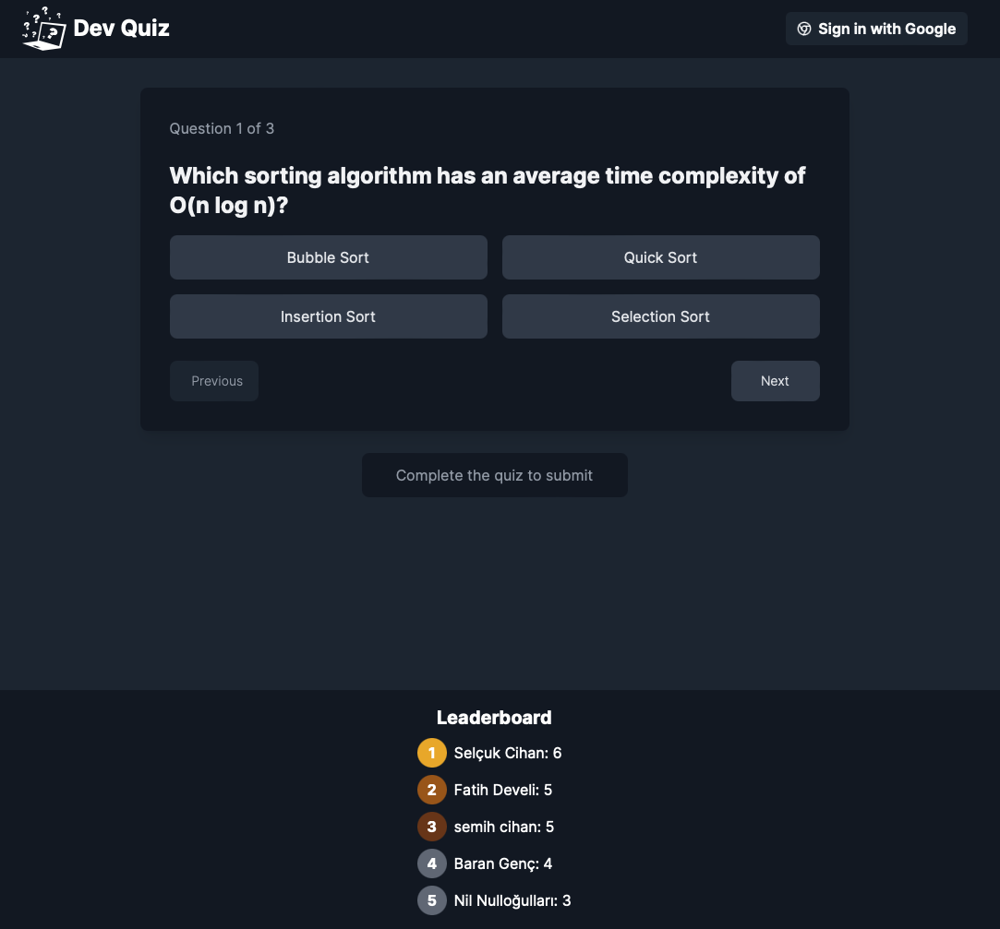

# Software Development Quiz Game

Take a look at the app live on https://quiz.selcukcihan.com



* This is an app developed using NextJS on [Vercel](https://vercel.com).
* The UI components were built using [v0.dev](https://v0.dev).
* Questions for the quiz are generated using a scheduled lambda that uses Google's Gemini, see https://github.com/selcukcihan/sasten-backend for more information.
* I'm using dynamodb as the database, next section details the data models involved.

## Data Models

### QuizUser

* This is the custom user record for the app. There is another user model (`AuthUser`) which is managed by auth.js
* For this model, the secondary index is used as a leaderboard.

```
{
  pk: USER#{userId},
  sk: QUIZ_USER#{userId},
  gsi1pk: LEADER_BOARD,
  gsi1sk: SCORE#{score}#{userId},
  score: number,
  gamesPlayed: number,
}
```

### Quiz

Represents a quiz with questions, options to select and the correct answer for each question.

```
{
  pk: QUIZ#{date},
  sk: QUIZ,
  questions: [
    {
      question: string,
      options: string[],
      answer: number,
    }
  ],
}
```

### Quiz Submission

* Represents a quiz submission of a user.
* We can query all submissions of a user on the primary index (table).
* We can query all submissions across all users, for a given date, using the secondary index.

```
{
  pk: USER#{userId},
  sk: QUIZ#{date},
  answers: number[],
  score: number,
  gsi1pk: SUBMISSION#{date},
  gsi1sk: USER#{userId},
}
```

### Models from Auth.js

#### AuthUser

```
{
  pk: USER#{userId},
  sk: USER#{userId},
  gsi1pk: USER#{email},
  gsi1sk: USER#{email},
  email: string,
  name: string,
}
```

#### AuthAccount

```
  pk: USER#{userId},
  sk: ACCOUNT#{provider}#{providerAccountId},
  gsi1pk: ACCOUNT#{provider},
  gsi1sk: ACCOUNT#{providerAccountId},
  provider: string,
  providerAccountId: string,
  userId: string,
```

#### AuthSession

```
  pk: USER#{userId},
  sk: SESSION#{sessionToken},
  gsi1pk: SESSION#{sessionToken},
  gsi1sk: SESSION#{sessionToken},
  userId: string,
  sessionToken: string,
  expires: number // after this date, TTL expires and dynamodb will delete the record
```

This is a [Next.js](https://nextjs.org/) project bootstrapped with [`create-next-app`](https://github.com/vercel/next.js/tree/canary/packages/create-next-app).

## Getting Started

First, run the development server:

```bash
npm run dev
# or
yarn dev
# or
pnpm dev
# or
bun dev
```

Open [http://localhost:3000](http://localhost:3000) with your browser to see the result.

You can start editing the page by modifying `app/page.tsx`. The page auto-updates as you edit the file.

This project uses [`next/font`](https://nextjs.org/docs/basic-features/font-optimization) to automatically optimize and load Inter, a custom Google Font.

## Learn More

To learn more about Next.js, take a look at the following resources:

- [Next.js Documentation](https://nextjs.org/docs) - learn about Next.js features and API.
- [Learn Next.js](https://nextjs.org/learn) - an interactive Next.js tutorial.

You can check out [the Next.js GitHub repository](https://github.com/vercel/next.js/) - your feedback and contributions are welcome!

## Deploy on Vercel

The easiest way to deploy your Next.js app is to use the [Vercel Platform](https://vercel.com/new?utm_medium=default-template&filter=next.js&utm_source=create-next-app&utm_campaign=create-next-app-readme) from the creators of Next.js.

Check out our [Next.js deployment documentation](https://nextjs.org/docs/deployment) for more details.
